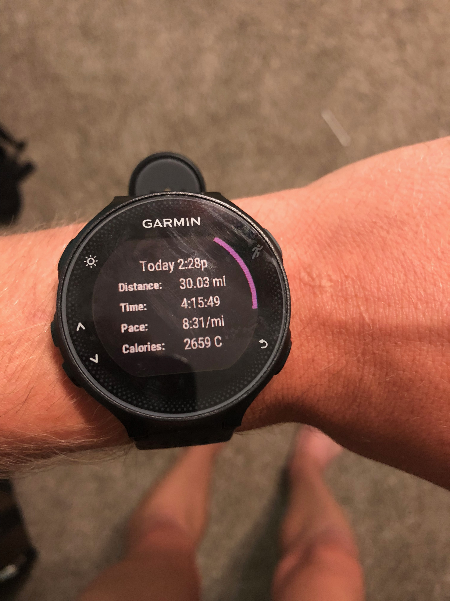
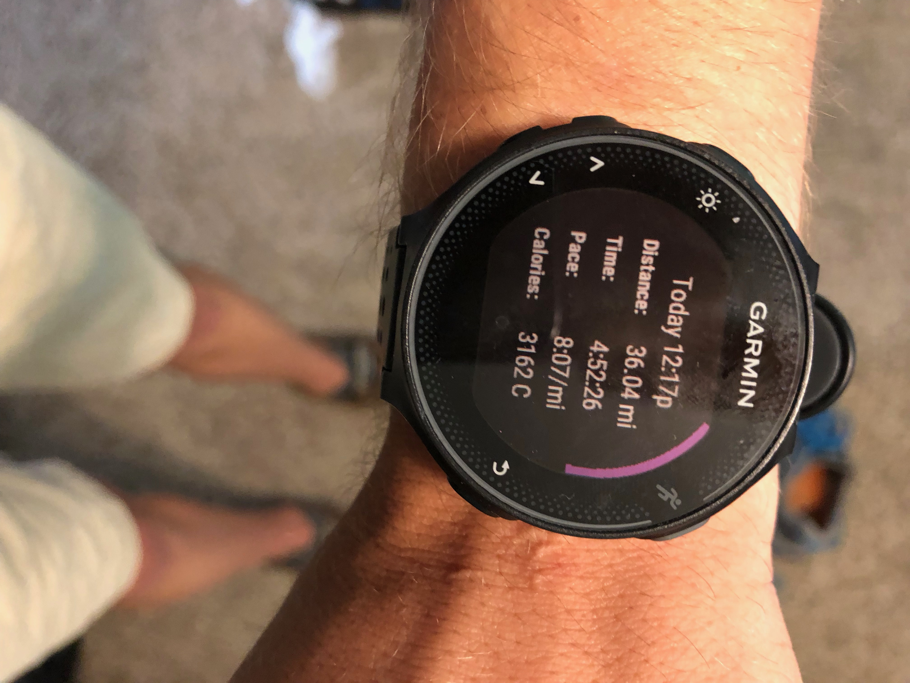
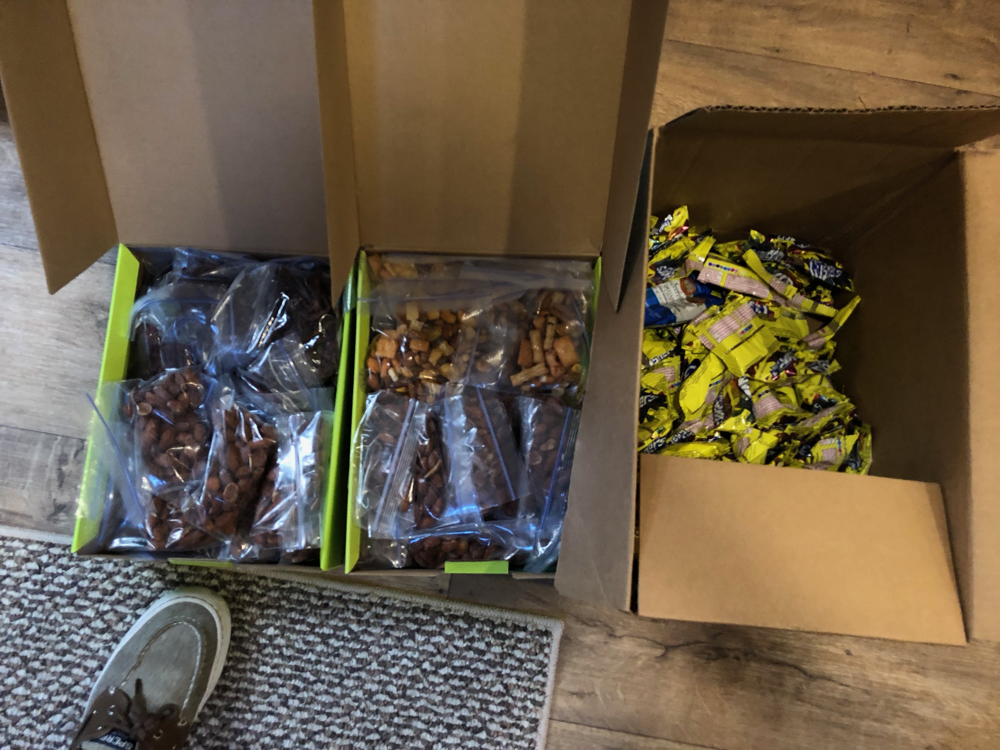
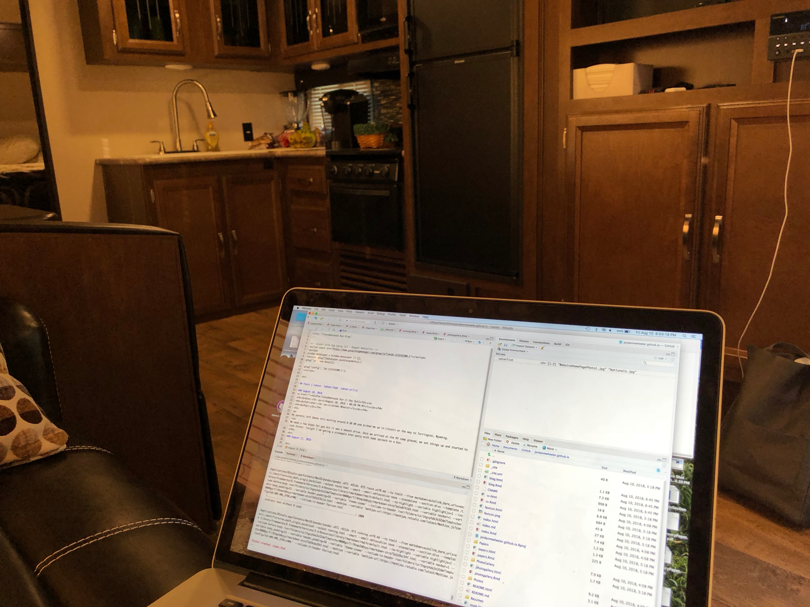
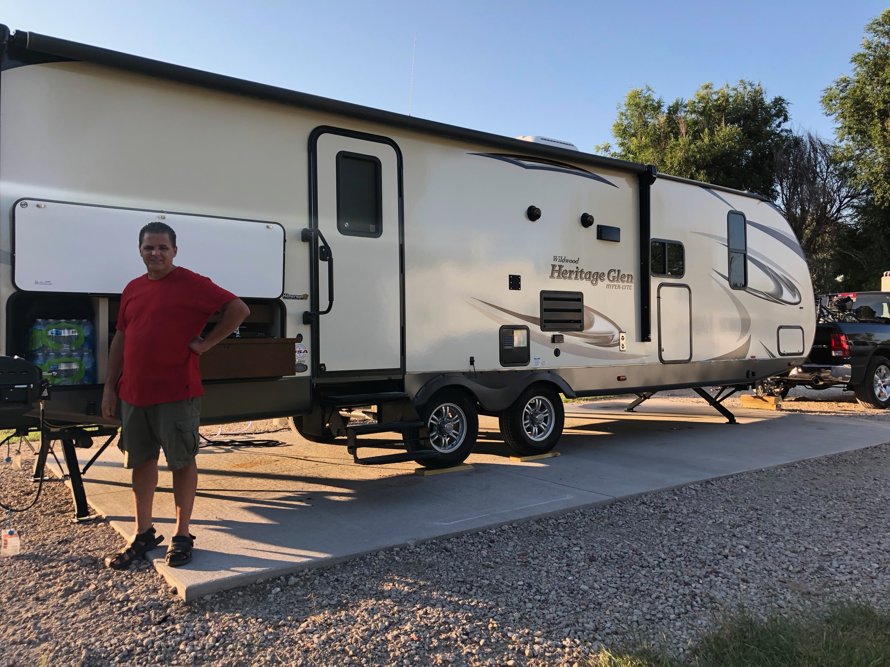
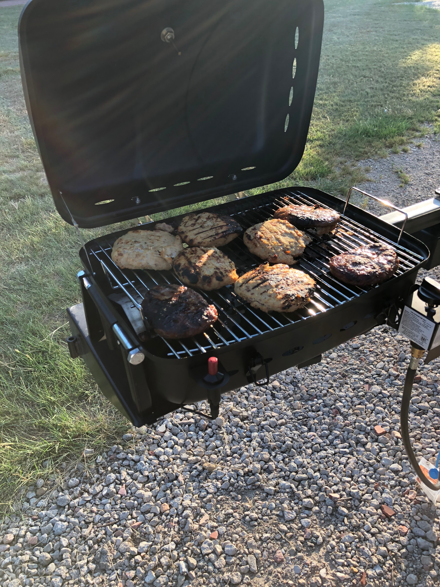

<link href="PhotoGallery/css/lightbox.css" rel="stylesheet">

<h3>TransNebraska Prep</h3>
<!-- MAIN (Center website) -->

<!-- Portfolio Gallery Grid -->

<h4 align="center">30 Mile Run in Prep for the TransNebraska Run</h4>

<h4 align="center">36 Mile Run in Prep for the TransNebraska Run.</h4>

<h3>Pre TransNebraska Run (One Day Out)</h3>

<h4 align="center">Snacks that will be eaten throughout the week.</h4>

<h4 align="center">An inside look of the camper while setting up this blog and photo gallery.</h4>

<h4 align="center">Outside look of the camper featuring my dad.</h4>

<h4 align="center">Pineapple Brat Patties for dinner before the first day!</h4>

<!-- END MAIN -->

